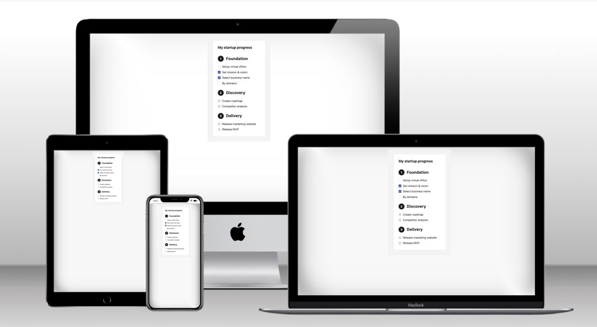

# Startup Progress Frontend

Simple website where you can mark and analyze the progress of your startup.

## Preview

    

## Tech Stack

- [CRA](https://create-react-app.dev/) - is an officially supported way to create single-page React applications. It offers a modern build setup with no configuration.
- [Typescript](https://www.typescriptlang.org/) - is a strongly typed programming language that builds on JavaScript, giving you better tooling at any scale.
- [Tailwindcss](https://tailwindcss.com/) - A utility-first CSS framework packed with classes that can be composed to build any design, directly in your markup.
  